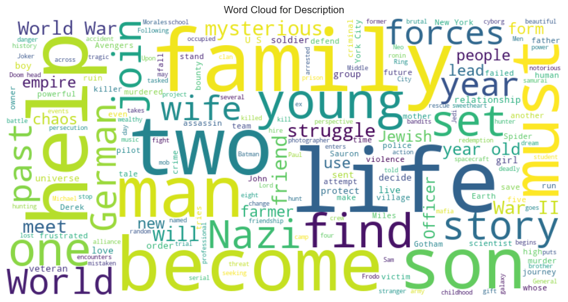

# IMDB TOP 100 MOVIE SCRAPER AND ANALYSIS

This project uses web scraping and data analysis techniques to collect and analyze information on the top 100 based on user rating movies listed on IMDb. The data is extracted using Selenium and BeautifulSoup, cleaned and transformed using Pandas, and visualized using Seaborn and Matplotlib.

## PROJECT OVERVIEW
The goal of this project is to scrape IMDb's Top 1000 movies, clean and preprocess the data, and analyze various attributes such as:

- Movie titles, release years, durations, and classifications.
- Ratings, metascores, and vote counts.
- Trends in movie releases and genres that receive high ratings.

This project provides insights into movie popularity over the years and helps identify key features that contribute to high ratings and success.

## DATA VISUALIZATION

### 1. Lets start by visualizing famous movie each year

**The years 1994 and 2019 stand out for having a high number of movies in the top 100, each producing several critically acclaimed and popular films.**

<ol>

<li>For 1994: This year saw the release of numerous iconic films included in the data. Notably, <i>The Shawshank Redemption</i>, often considered one of the greatest films of all time, was nominated for 7 Academy Awards. <i>Pulp Fiction</i>, known for revolutionizing narrative structure in films, won Best Original Screenplay at the Academy Awards and the Palme d'Or at the Cannes Film Festival. Additionally, <i>Forrest Gump</i> won 6 Academy Awards, including Best Picture, and <i>The Lion King</i>, one of Disney's most successful animated films, won 2 Academy Awards and 3 Golden Globe Awards.</li>

<li>For 2019: This year also produced several notable films. <i>Parasite</i> became the first non-English language film to win Best Picture. <i>Avengers: Endgame</i> was the second highest-grossing film of all time (until recently). <i>Joker</i> generated significant discussion on mental health and society, winning Best Actor and Best Original Score at the Academy Awards.</li>
</ol>

### 2. Distribution of rating and vote count 

- We see that the top 100 IMDB film based on rating all have 8.3 rating

### 3. Number of metascores by film classification

### 4. Correlation between duration and vote count

### 5. Wordcloud - Is description affect film's popularity ?

The word cloud highlights key themes in top-rated IMDb movies, including:

- Character focus: Words like "man", "wife", and "father" show personal relationships.
- Conflict: Terms such as "war", "fight", and "struggle" reflect intense drama.
- Genre variety: Includes genres like historical, thriller, and fantasy.
- Setting: Words like "year" and "city" indicate diverse times and locations.
- Emotion and themes: Emotional depth with themes like "freedom", "protect", and "lead".

This captures the recurring elements in highly-rated films.

Read more in [IMDB-Analytics](https://github.com/haphuong1810103/IMDB-Analytics).
